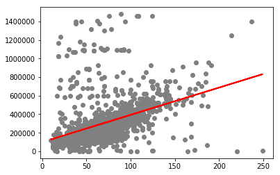
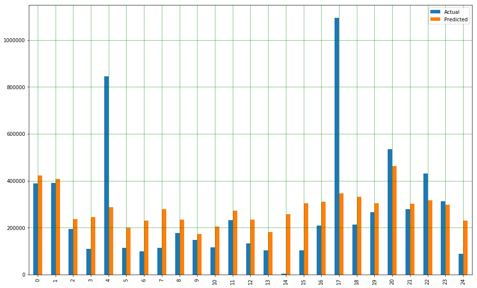
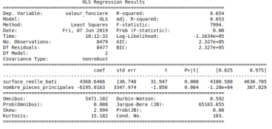

# Real Estate Prediction Project 

### __Our mission :__
A real estate agency from Lyon would like to have an app which allows its users to find info on housing prices of apartments depending on the surface, number of rooms and the localization. 
They would also like to use the model to see if there are similar offers of if the prices they want to apply are over or under the global market price.
For this such use we need to create and train different models for comparison.

### __Data source :__

DVF database

### __Examples of models that can be used :__

- Multiple regression model
- Decision tree
- K-nearest neighbors ...

## The files :

1. *constantes :*

List containing ZIP codes of Lyons' Burroughs

2. *datas_file :*

First we create a class that we will name "Data".
Then, in our class we will :

- Read and merge the csv files
- Remove all dots that are in ZIP codes
- Transform them from floats to ints
- Sort ZIP codes
- Sort columns by apartment, surface area, price, ZIP code
- Delete useless rows (empty data)
- Delete dirty data (prices too high or too low for the market)

3. *functions :*

- The first function cleans the data, sorting through data and removing useless info
- The second function is a linear approach to modeling the relationship between a scalar response and a explanatory variable
- The third function is a multi-linear approach several explanatory variables

4. *main :*

This file imports all functions, cleans the data.
The first function only takes into consideration the surface of the apartments.
The second function takes into account the surface, the number of bedrooms, the coefficient of error and shows a 3D graph.
The third function uses a decision tree.

5. *csv files :*

Raw data of real estate in Lyon.

6. *regressions_multiples*

This file allows use to check and see if our calculations are correct and we get the same results at the end.
The file has comments explaining each step. 

Linear regression visualized :

Comparison :

Statistical recap :

